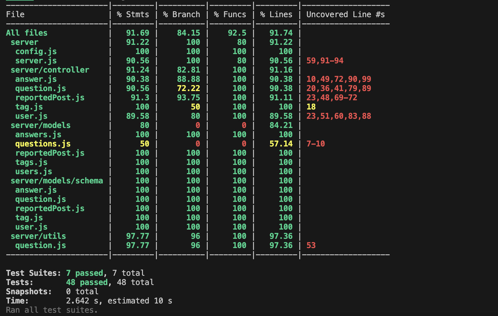

# Final Team Project for CS5500

Login with your Northeastern credentials and read the project description [here](https://northeastern-my.sharepoint.com/:w:/g/personal/j_mitra_northeastern_edu/ETUqq9jqZolOr0U4v-gexHkBbCTAoYgTx7cUc34ds2wrTA?e=URQpeI).

## List of features

All the features you have implemented.

| Feature                         | Description               | E2E Tests                 | Component Tests                 | Jest Tests            |
| ------------------------------- | ------------------------- | ------------------------- | ------------------------------- | --------------------- |
|                                 |                           | Path: /client/cypress/e2e | Path: /client/cypress/component | Path: /server/tests   |
|                                 |                           |                           |                                 |                       |
|                                 |                           | Individual files          | Individual files                | Individual files      |
|                                 |                           |                           |                                 |                       |
| 1. View Posts                   | User can view existing    | /home.cy.js               | /questionPage.cy.js             | /question.test.js     |
|                                 |                           |                           |                                 |                       |
|                                 | post including the        |                           |                                 |                       |
|                                 | comments, views etc.      |                           |                                 |                       |
|                                 |                           |                           |                                 |                       |
| 2. New post                     | User can create a         | /newquestion.cy.js        | /newquestion.cy.js              | /newQuestion.test.js  |
|                                 | new post.                 |                           |                                 |                       |
|                                 |                           |                           |                                 |                       |
| 3. Search existing post         | User can search keywords  | /server.cy.js             | /header.cy.js                   | /server.test.js       |
|                                 | tags for an existing      |                           |                                 |                       |
|                                 | post.                     |                           |                                 |                       |
|                                 |                           |                           |                                 |                       |
| 4. Answering on posts           | User can add answer or    | /newanswer.cy.j           | /newAnswer.cy.js                | /newAnswer.test.js    |
|                                 | commenton a post.         |                           |                                 |                       |
|                                 |                           |                           |                                 |                       |
| 6. Voting on posts              | User can upVote or        | /newanswer.cy.j           | /answerPage.cy.js               | /newAnswer.test.js    |
|                                 | downVote a post once.     |                           |                                 |                       |
| 7. Tagging posts                | User can add tags to      | /tags.cy.j                | /tagPage.cy.js                  |                       |
|                                 | the post.                 |                           |                                 | /tags.test.js         |
|                                 |                           |                           |                                 |                       |
| 8a. User Profile                | User can sign up and add  | /signup.cy.js             | /signUp.cy.js                   | /user.test.js         |
|                                 | a new profile by entering |                           |                                 |                       |
|                                 | their details.            |                           |                                 |                       |
|                                 |                           |                           |                                 |                       |
| 8b. View a profile              | User can login, cick on   |                           |                                 |                       |
|                                 | their name to view detils | /login.cy.js              | /profilePage.cy.js              | /user.test.js         |
|                                 | related to their profile. |                           |                                 |                       |
|                                 |                           |                           |                                 |                       |
| 9a. Post moderation - Moderator | A moderator can review    | /moderatorPage.cy.js      | /moderationPage.cy.js           | /reportedPost.test.js |
|                                 | all the reported posts,   |                           |                                 |                       |
|                                 | report a post,            |                           |                                 |                       |
|                                 | delete an answer on the   |                           |                                 |                       |
|                                 | post or delete the        |                           |                                 |                       |
|                                 | entire post.              |                           |                                 |                       |
|                                 |                           |                           |                                 |                       |
| 9b. Post moderation - User      | User can report a post.   | /moderatorPage.cy.js      | /moderationPage.cy.js           | /reportedPost.test.js |

## Instructions to generate and view coverage report

We have generated the Jest coverage report. To do so, change the directory to `/server` and run the command `npx jest -w=1 --coverage`. The tests are run sequentially because some tests fail due to port issues or race conditions.

Sample report:

## Extra Credit Section (if applicable)
